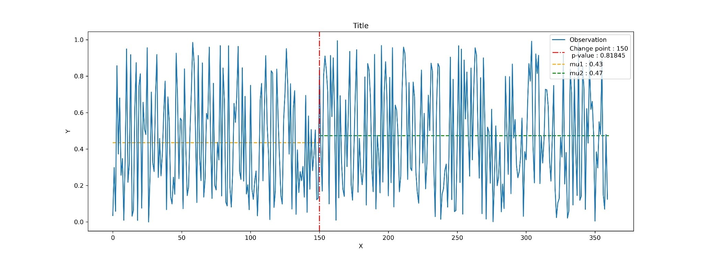

# Summary
The homogeneity test is a statistical test method that checks if two (or more) datasets came from the same distribution or not. In the time series, the homogeneity test is applied to detect one (or more) change-point/breakpoint in the series. This breakpoint occurs where the data set changes its distribution. This  detection of distribution change makes the homogeneity test an essential test in statistical analysis. There are several tests available to check homogeneity. These tests can be performed using several commercial software packages and different programming languages. However, a single package to perform most widely used homogeneity tests will save time and bring diversity in the analysis.

Python is one of the widely used tools used by the data scientist. A large number of data analysis and research tools are also developed using Python. However, till now, there is no Python package available for the homogeneity test. `pyHomogeneity` package fills this gap. It is a pure Python implementation for the homogeneity test. `pyHomogeneity` can perform six homogeneity tests (three test differenct test with four variant of Buishand's test), which are widely used in time series analysis. Available tests in `pyHomogeneity` package are briefly discussed below:

**Pettitt's Test:** In 1979, Pettitt proposed a change-point detection test based on Mann-Whitney two-sample test [@pettitt1979non]. This test is more sensitive to detect breaks near the middle of a time series [@Mahmud2015homo]. For the continuous dataset, Pettitt's statistics $U(k)$ can be calculated using following equation:

\begin{equation*}
U(k) = 2 \sum_{i=1}^n r_i - k (n + 1)
\end{equation*}

Where $r_1$,  $r_2$,  $r_3$, ………, $r_n$ are the ranks of the n observations $x_1$, $x_2$, $x_3$, ......, $x_n$ in the complete sample of n observations. The maximum absolute value of $U(k)$ is referred to the possible change-point at $k$-th data. The approximate probability for a two-sided test is given by

\begin{equation*}
p = 2 \exp  \left(\frac{ -6*(\max(\lvert U(k) \rvert))^2}{n^3 +n^2} \right)
\end{equation*}

Where, the approximate probability is useful for $p \leq 0.5$ [@pettitt1979non]. The probability or critical values for the test statistic also can be estimated by using Monte Carlo simulation.

**Standard Normal Homogeneity Test (SNHT):** Standard Normal Homogeneity Test (SNHT) is based on the Ratio Test Method [@alexandersson1986homogeneity].  This method is best suitable to detect inhomogeneity near the beginning and end of the series [@Mahmud2015homo]. The test statistic $T(k)$ is calculated by comparing the mean of the first $k$ data of the record with the last $n-k$ data as follows:

\begin{equation*}
T(k) = k \bar{z}_1^2 + (n + k) \bar{z}_2^2
\end{equation*}

Where,
\begin{equation*}
\bar{z}_1 = \frac{1}{k} \sum_{i=1}^k \frac{x_i - \bar{x}}{S}
\end{equation*}
\begin{equation*}
\bar{z}_2 = \frac{1}{n-k} \sum_{i=k+1}^n \frac{x_i - \bar{x}}{S}
\end{equation*}
\begin{equation*}
S = \text{sample standard deviation} = \sqrt{ \frac{1}{n-1} \sum_{i=1}^n \left(x_i - \bar{x} \right)^2}
\end{equation*}
\begin{equation*}
n = \text{number of sample data}
\end{equation*}

The test statistic $T(k)$ reaches it's maximum value when a breakpoint is detected at the data point $k$. The test statistic $T_0$ is defined as:

\begin{equation*}
T_0 = max(T(k))
\end{equation*}

The null hypothesis will be rejected if $T_0$ is above a certain level, which can be estimated by using Monte Carlo simulation.

**Buishand's test:** Buishand proposed a homogeneity test method based on adjusted partial sums [@buishand1982some]. The Buishand's range test is best suitable for detecting breaks in the middle of a time series [@Mahmud2015homo]. The test statistics is given below:

\begin{equation*}
S(k) = \sum_{i=1}^k \frac{x_i - \bar{x}}{ \sigma}
\end{equation*}

Where,

\begin{equation*}
\sigma = \text{standard deviation} = \sqrt{ \frac{1}{n} \sum_{i=1}^n \left(x_i - \bar{x} \right)^2} \\
\end{equation*}

The maximum absulate value of $S(k)$ is referred to as the probable change-point at $k$-th data.
[@buishand1982some] proposed four different methods to check the statistical significance of this homogeneity test. These four methods are -

**_Q test:_**  In this method, calculate $Q$ as using the equation below and estimate critical values for the test statistic using the given table by Buishand [@buishand1982some] or using Monte Carlo simulation.

\begin{equation*}
Q = \frac{ \max(S(k))}{ \sqrt{n} }
\end{equation*}

**_Range test:_** In this method, calculate the range $R$ using the equation below and estimate critical values for the test-statistic using given table by Buishand [@buishand1982some] or using Monte Carlo simulation.

\begin{equation*}
R = \frac{ \max(S(k)) - \min(S(k))}{ \sqrt{n} }
\end{equation*}

**_Likelihood Ratio test:_** the test statistics $V(k)$ is calculated as using the equation below and estimate critical values for the test-statistic using Monte Carlo simulation.

\begin{equation*}
V = \max \left( \frac{ \lvert S(k) \rvert}{ \sqrt{k(n-k)} } \right)
\end{equation*}

**_U Test:_** $U$ statistics is a robust test and good to detect change-point in middle of series [@buishand1984tests]. The $U$ statistics is calculated as using the equation below and estimate critical values for the test-statistic using the given table by Buishand [@buishand1982some] or using Monte Carlo simulation.

\begin{equation*}
U = \frac{1}{n(n+1)} \sum_{i=1}^{n-1} S(k)^2
\end{equation*}

# Example
A quick example of pyHomogeneity usage is given below.
``` python
import numpy as np
import pyhomogeneity as hg
import matplotlib.pyplot as plt

# Data generation for analysis
data = np.random.rand(360,1)

result = hg.pettitt_test(data)
print(result)
```
Output are like this:
``` python
Pettitt_Test(h=False, cp=89, p=0.1428, U=3811.0,
             avg=mean(mu1=0.5487521427805625, mu2=0.46884198890609463))
```
Whereas, the output is a named tuple, so user can call by name for specific result:
``` python
print(result.cp)
print(result.avg.mu1)
```

or, user can directly unpack the results like this:
``` python
h, cp, p, U, mu = hg.pettitt_test(x, 0.05)
```

User can be plot their results by follow:
``` python
mn = 0
mx = len(data)

loc = result.cp
mu1 = result.avg.mu1
mu2 = result.avg.mu2

plt.figure(figsize=(16,6))
plt.plot(data, label="Observation")
plt.hlines(mu1, xmin=mn, xmax=loc, linestyles='--', colors='orange',lw=1.5,
           label='mu1 : ' + str(round(mu1,2)))
plt.hlines(mu2, xmin=loc, xmax=mx, linestyles='--', colors='g', lw=1.5,
           label='mu2 : ' + str(round(mu2,2)))
plt.axvline(x=loc, linestyle='-.' , color='red', lw=1.5,
            label='Change-point : '+ str(loc) + '\n p-value : ' + str(result.p))

plt.title('Title')
plt.xlabel('X')
plt.ylabel('Y')
plt.legend(loc='upper right')

plt.savefig("F:/aaaaaa.jpg", dpi=600)
```



# Acknowledgements
This work is done under the project _"Python packages/tools development for environmental research"._

# References